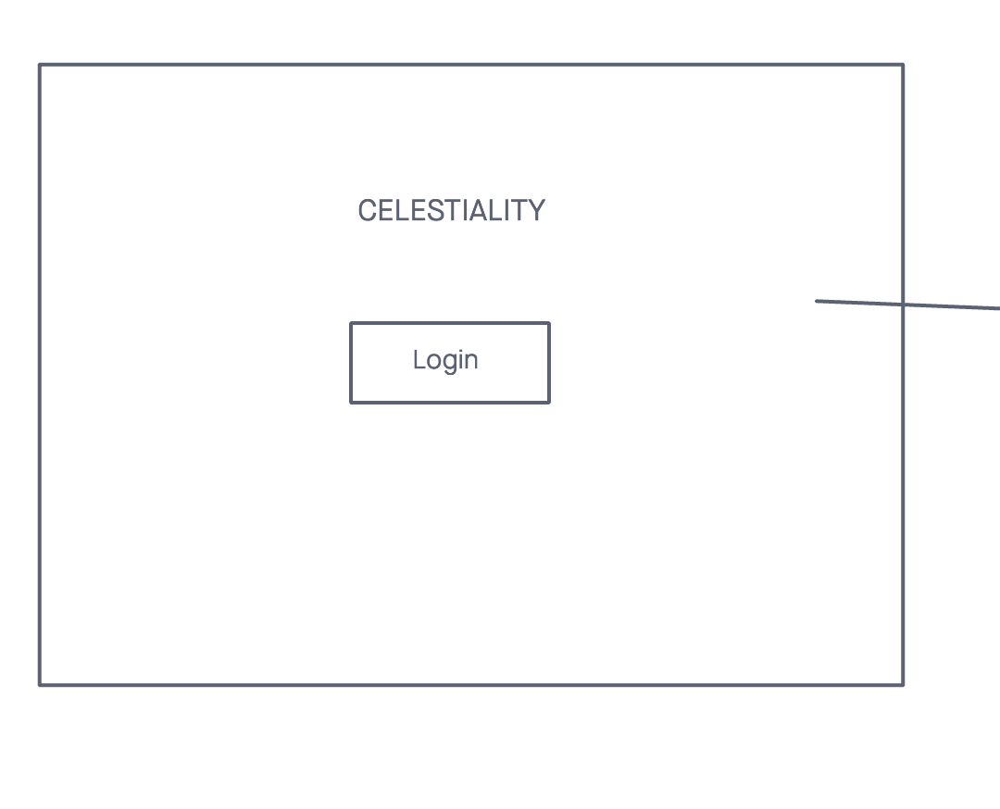
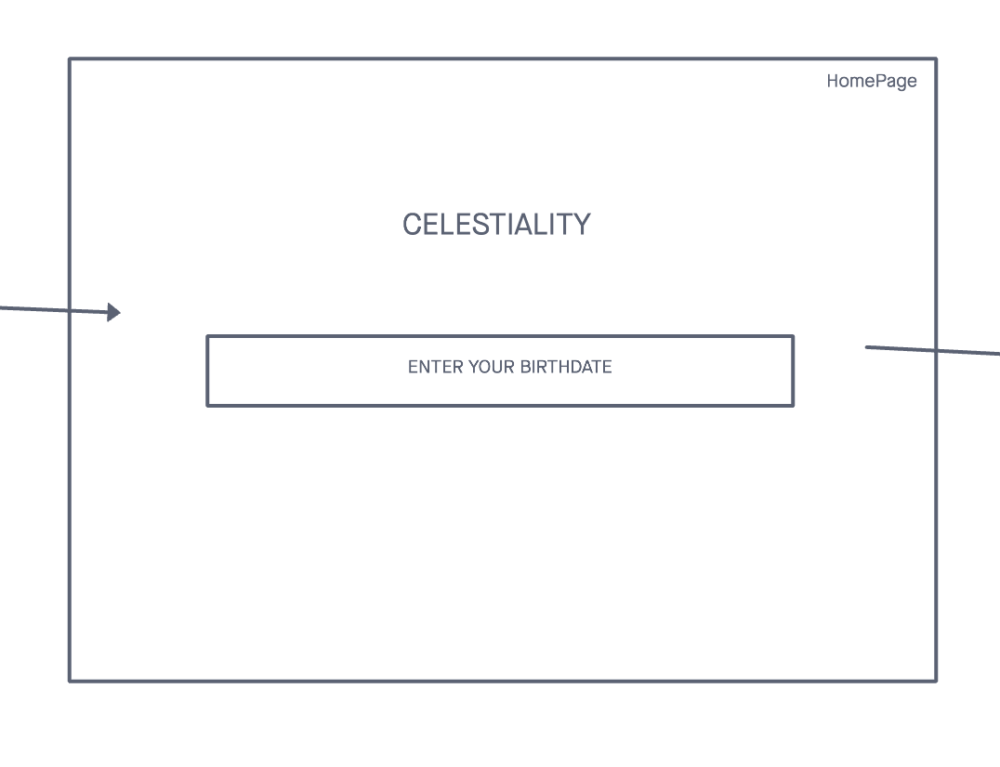
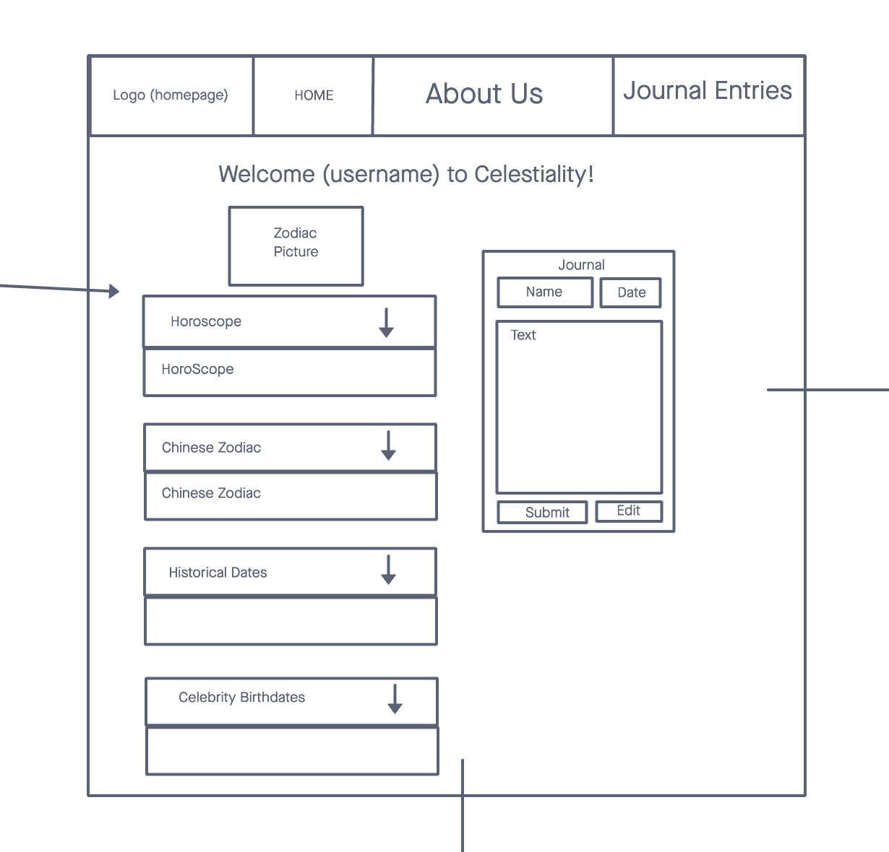
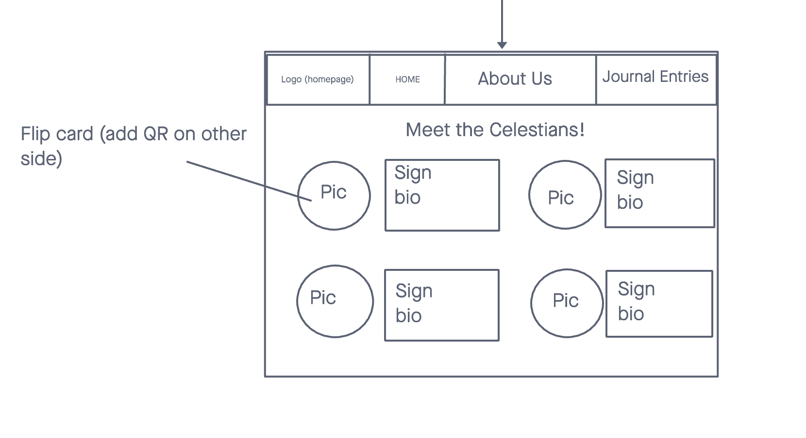
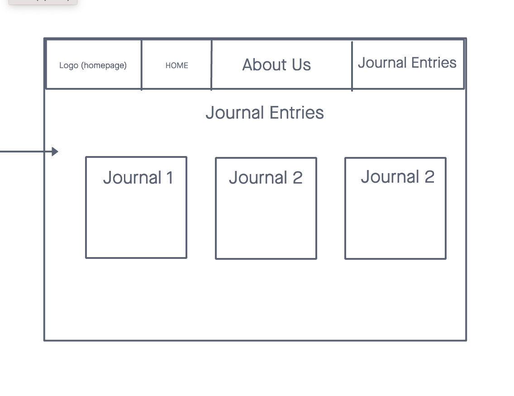

# Celestiality

**Author**: Angela Dzodzomenyo, Chris Reichert, Brandon Mizutani, Bionca Bond
**Version**: 1.0.0 (Netlify: [Netlify] | Trello: [Trello](https://trello.com/b/EJEoICSx/cabb-group) | Heroku: [Heroku]()

## Overview
  Our app, Celestiality, is designed for people who would like to learn more about their special day....their Birthday! It provides users information about: their astrological sign, their Chinese New Year Zodiac, and so much more!

## Getting Started

### WireFrame

## Architecture

REACTJS, JS, CSS

## Change Log

11-08-2021 8:30pm - Celestiality application backend and frontend are deployed.

## Estimates

### Lab 11 - Backend

## Credit and Collaborations
JP Jones
TA