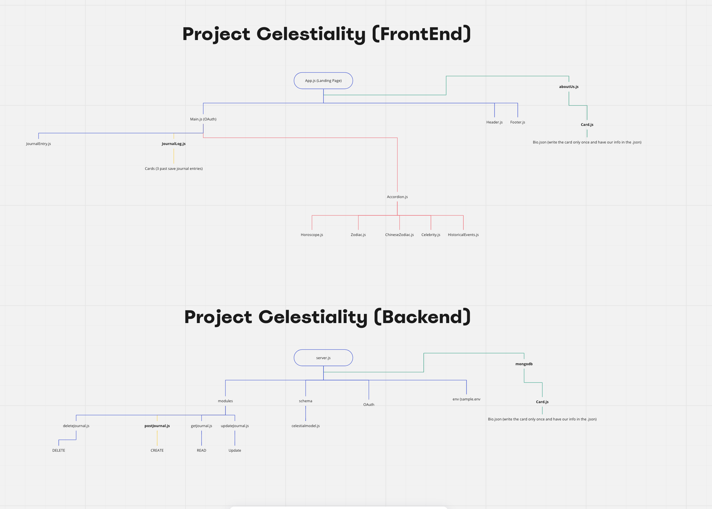
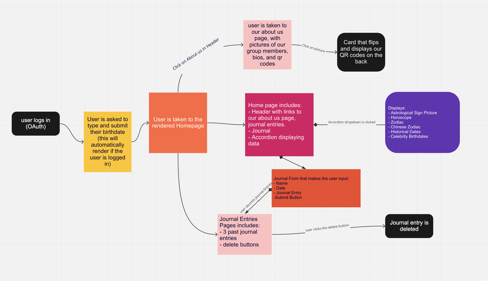
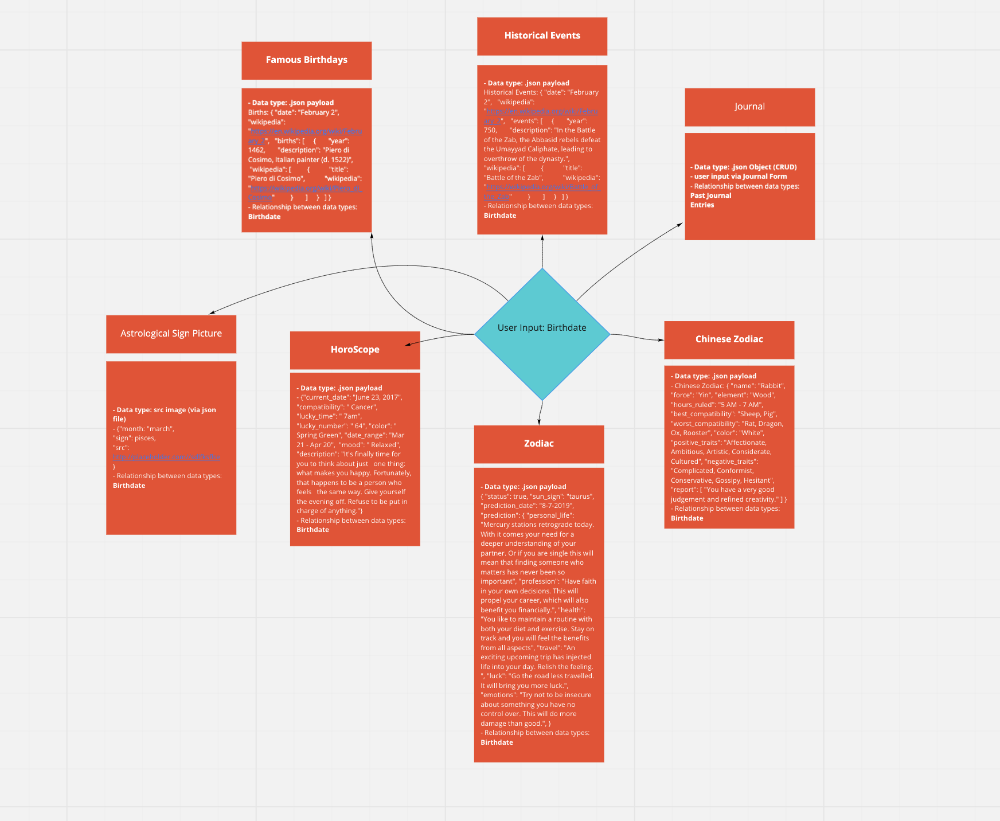

# Celestiality

**Author**: Angela Dzodzomenyo, Chris Reichert, Brandon Mizutani, Bionca Bond
**Version**: 1.0.0 (Netlify: [Netlify] | Trello: [Trello](https://trello.com/b/EJEoICSx/cabb-group) | Heroku: [Heroku]()

## Overview
  Our app, Celestiality, is designed for people who would like to learn more about their special day....their Birthday! It provides users information about: their astrological sign, their Chinese New Year Zodiac, and so much more!

## Getting Started

### WireFrame

### User Stories

Story Points 
Each story in your project management board should contain: 

User Story 1: Horoscope
-View Horoscope
-“As a user I want to enter my birthday and view my Horoscope. 
-Show the Horoscope for that day. 
-Ensure that the correct Horoscope is displayed for the respective birthdate. 

User Story 2: Chinese New Year
-View Chinese New Year
-“As a user I want to enter my birthday and view my Chinese New Year Zodiac. 
-Show the Chinese New Year for that birthdate. 
-Ensure that the correct Chinese New Year is displayed for the respective birthdate. 

User Story 3: Historical Dates
View Historical Dates
-“As a user I want to enter my birthday and view Historical Dates. 
-Show the Historical Dates that happened on that birthdate. 
-Ensure that the correct Historical -Dates are displayed for the respective birthdate. 

User Story 4: Celebrity Birthdays
-View Celebrity Birthdays
-“As a user I want to enter my birthday and view Celebrity Birthdays. 
-Show the Celebrity Birthdates that happened on that birthdate. 
-Ensure that the correct Celebrity Birthdays are displayed for the respective birthdate. 

User Story 5: Journal Entries 
-Add and view journal entries. 
-“As a user I want to record a journal entry on a given date.  
-Show the previous journal entries that have been entered by the user.  
-Ensure that the correct previous journal entries are displayed for the respective date..

## Domain Modeling

## Domain Schema

## Architecture

REACTJS, JS, CSS

## Change Log

11-08-2021 8:30pm - Celestiality application backend and frontend are deployed.

## Estimates

### Lab 11 - Backend

## Credit and Collaborations
JP Jones
TA